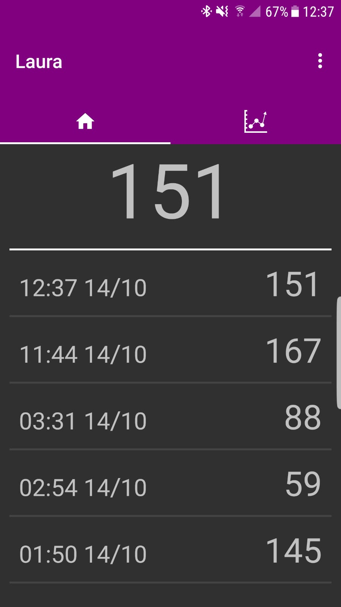
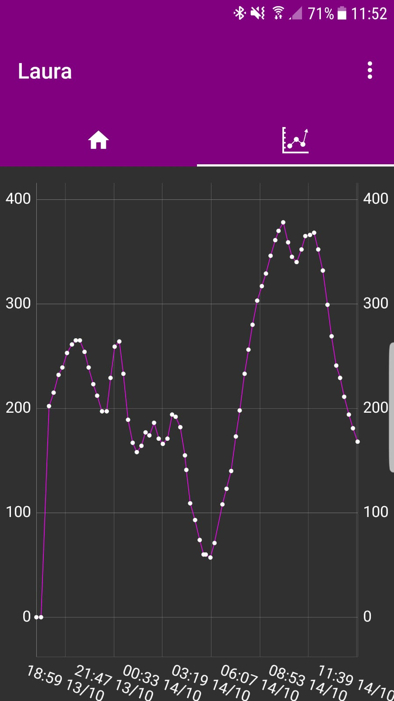
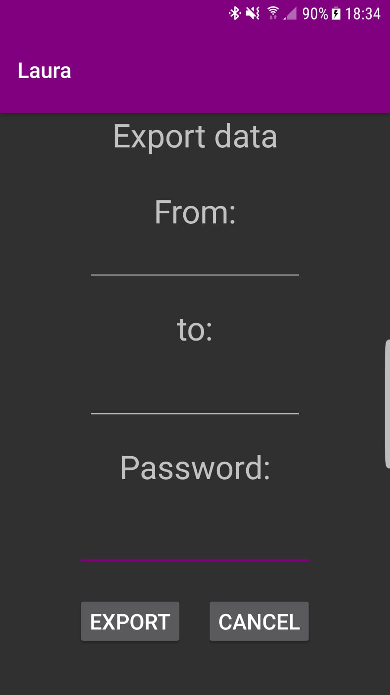
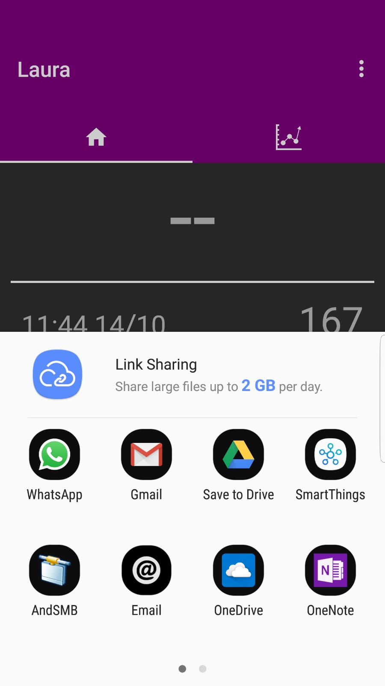

# Trabajo fin de grado
## Laura

Application that read Free Style Libre and record all measures on embedded database.

### Features
- Read Free Style Libre
- Time series with glucose measures
- Export data

### Images

  
  
   
  

## Nfc-reader

Android application that read Free Style Libre and send measures to HTTP server.

## Server

Python HTTP server that listen on port 5000.
